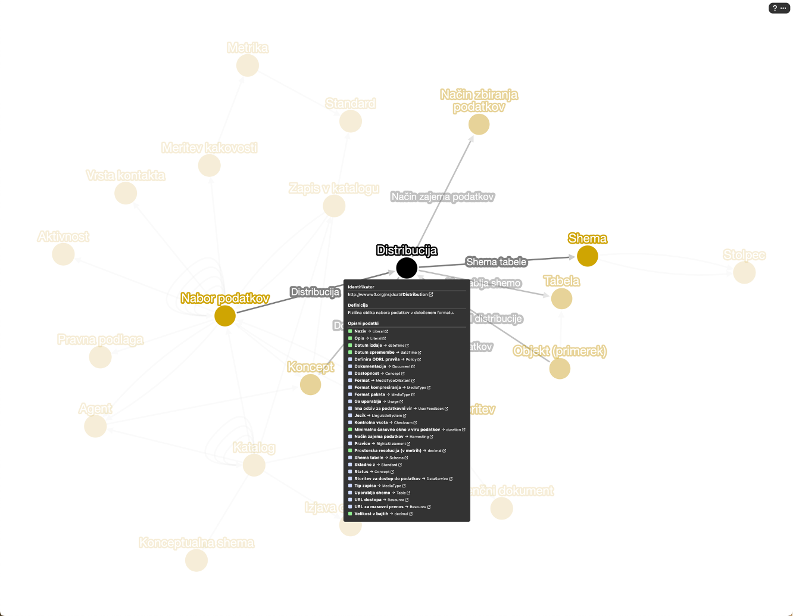
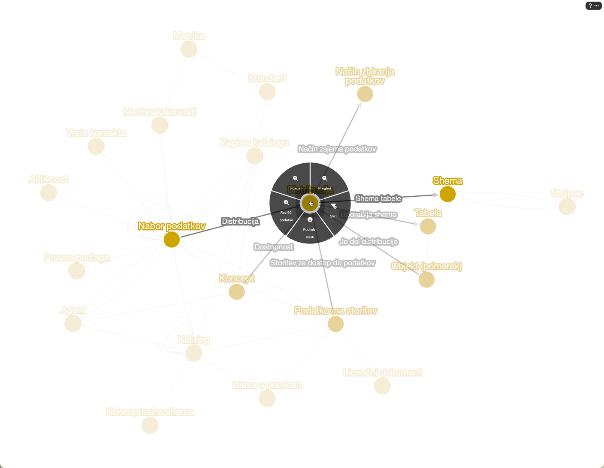
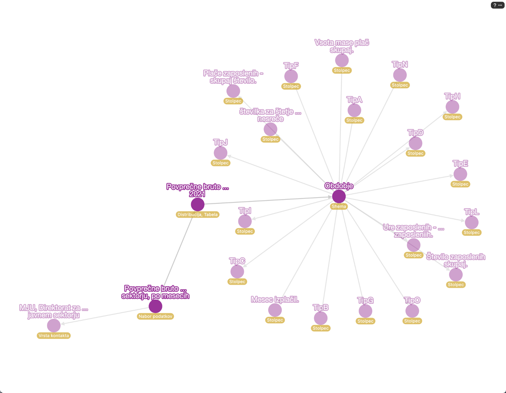
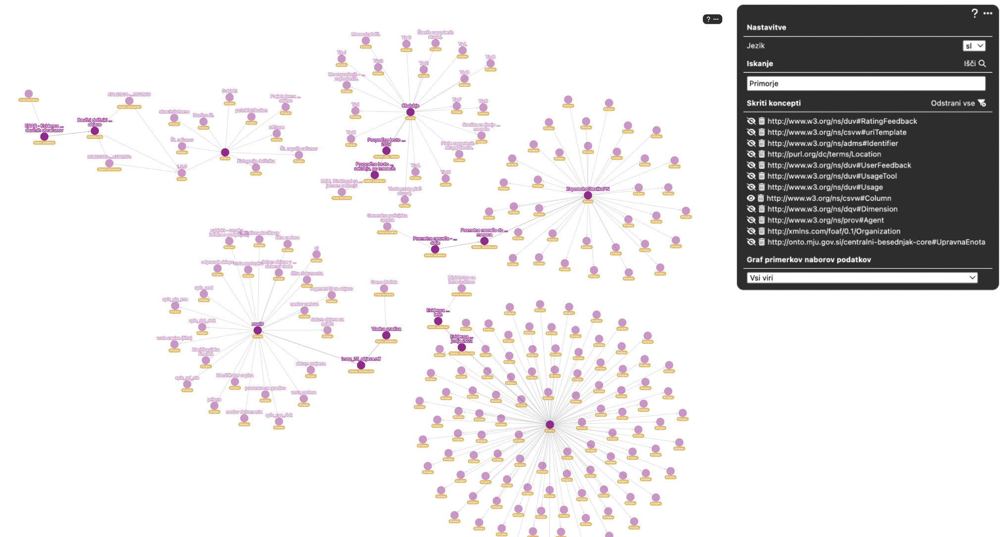
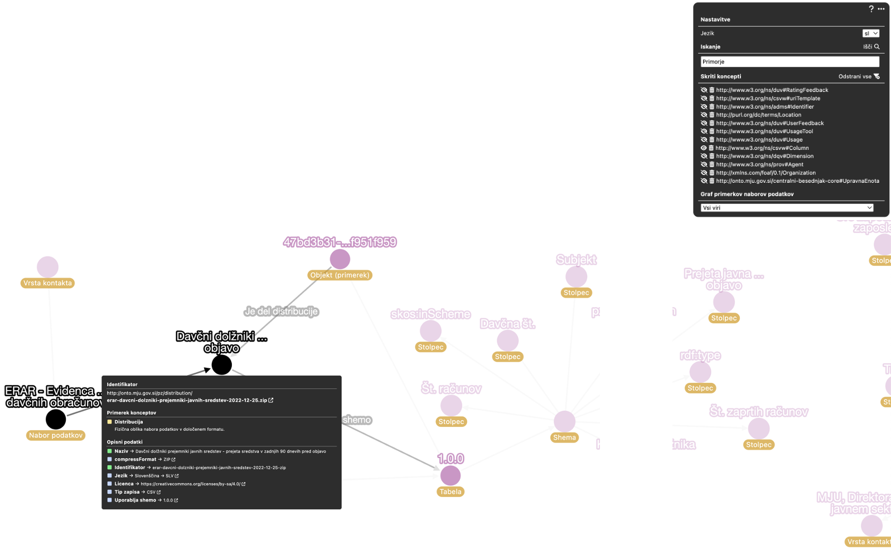

# CKAN Datamap

CKAN Datamap is a generic client-based component that connects to a Fuseki server and shows an ontology schema along with instances.

Current visualization is based on DCAT and other ontologies, applied to the Slovenian data map for open data portal. For more information about the project please see the main repository [https://github.com/FRI-MDP/Podatkovni-zemljevid-2023](https://github.com/FRI-MDP/Podatkovni-zemljevid-2023) or contact [Ministry of Digital Transformation of the Republic of Slovenia](https://www.gov.si/en/state-authorities/ministries/ministry-of-digital-transformation/), contact person Miha Jesenko. Project was designed and developed by Dejan Lavbič and Slavko Žitnik.

The project is loosely coupled with the CKAN project. The component is directly integrated into CKAN Web pages (CKAN landing page and CKAN resource *webview plugin*). Similarly could be integrated into an arbitrary Web page.

DEMO: [https://fri-mdp.github.io/ckan-datamap/](https://fri-mdp.github.io/ckan-datamap/)

Some examples of Datamap visualizations:

Figure 1: Main visualization of top-level classes.

Figure 2: Right-click functionality.

Figure 3: Instances visualization.

Figure 4: Instances with option to visualize specific resources or namespaces.

Figure 5: Checking attributes of a specific object.
